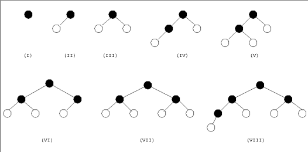
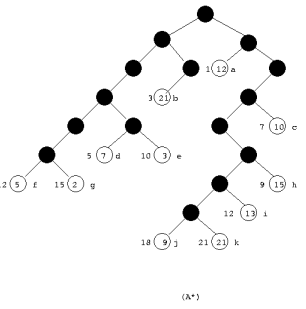

# 1. Agentes de Solução de Problemas

## 1.1 Objetivos

Agentes inteligentes buscam maximizar seu desempenho, o que é alcançado ao definir objetivos claros e específicos. Esses objetivos ajudam a simplificar a tomada de decisão, permitindo que o agente filtre as ações mais relevantes para alcançar o resultado desejado.

**Exemplo:** Em uma viagem de férias saindo de Goiânia, o agente pode definir como objetivo chegar a Brasília. Com esse objetivo em mente, ele pode focar apenas nas rotas que levam à capital federal, tornando a escolha da estrada mais eficiente.

## 1.2 Formulação de Problemas

Para alcançar seus objetivos, o agente precisa formular o problema de maneira eficaz, selecionando as ações e estados mais adequados para a solução.

**Exemplo:** No contexto da viagem de Goiânia a Brasília:
- O objetivo é chegar a Brasília.
- As ações consideradas podem ser dirigir entre cidades como Goiânia para Formosa ou Alexânia para o Distrito Federal.

A formulação do problema envolve decidir quais ações e estados são relevantes para alcançar o objetivo de forma eficiente, ignorando detalhes irrelevantes.

## 1.3 Busca e Execução

A resolução de problemas por um agente envolve:
1. Um **processo de busca** para encontrar uma sequência de ações que o conduza ao objetivo.
2. A **execução** dessa sequência sem ajustes baseados em percepções durante o percurso.

**Exemplo:** Durante a viagem de Goiânia a Brasília, o agente precisa buscar a melhor rota e, após identificá-la, segui-la rigidamente. Esse comportamento caracteriza um sistema de malha aberta, onde o agente não reage a mudanças no ambiente.

## 1.4 Definindo Problemas

A formulação de um problema pode ser descrita por cinco componentes principais:

1. **Estado inicial:** Local onde o agente começa.
   - *Exemplo:* Goiânia.
2. **Ações disponíveis:** Opções que o agente pode tomar.
   - *Exemplo:* Dirigir de Goiânia para Formosa ou Alexânia.
3. **Modelo de transição:** Define como cada ação leva a um novo estado.
4. **Teste de objetivo:** Condição para verificar se o objetivo foi alcançado.
   - *Exemplo:* Chegar a Brasília.
5. **Função de custo:** Mede o custo de cada caminho.
   - *Exemplo:* Tempo ou distância das rotas.

Com essas informações, o agente pode encontrar a solução ótima.

---

# 2. Problemas de Malha Aberta e de Malha Fechada

Os problemas de malha aberta envolvem um planejamento fixo, sem reagir a mudanças no ambiente durante a execução. Já os problemas de malha fechada permitem ajustes dinâmicos baseados em percepções do ambiente.

---

# 3. Algoritmos de Busca

Os algoritmos de busca são fundamentais para a resolução de problemas em inteligência artificial, permitindo que um agente encontre uma sequência de ações que o leve ao seu objetivo. Eles exploram um **espaço de estados**, o conjunto de todas as possíveis situações que o agente pode encontrar durante sua tarefa.

## 3.1 Busca Cega

A **busca cega**, também conhecida como **busca não-informada**, é uma estratégia que não utiliza conhecimento prévio sobre o ambiente ou o objetivo final. Essas técnicas exploram o espaço de estados de forma sistemática, baseando-se apenas em uma função de enfileiramento para determinar os próximos passos.

### 3.1.1 Busca em Largura

A **busca em largura** é um exemplo de busca cega, pois explora os estados sem utilizar informações sobre a solução, baseando-se apenas na ordem de geração dos estados. Ela explora todos os estados de um nível antes de avançar para o próximo. Essa abordagem é eficaz para encontrar a solução mais curta, mas pode consumir muita memória, já que armazena todos os estados do nível atual.

**Principais características:**
- Garante encontrar o caminho mais curto (caso os custos de transição sejam iguais).
- Alto consumo de memória em problemas de grande escala.

**Exemplo visual:**

  
*Figura 1: Demonstração teórica do funcionamento da busca em largura.*

## 3.2 Busca Informada

A **busca informada** é uma estratégia que utiliza informação adicional para determinar a ordem de expansão dos nós durante o processo de busca. Essa informação, chamada de função de avaliação, ajuda a medir a probabilidade de um nó levar à solução, com base no seu estado atual. As buscas informadas tentam priorizar os nós que têm maior chance de levar à solução de forma mais eficiente.

  
*Figura 2: Demonstração teórica do funcionamento da busca informada.*

A **busca A\*** é um exemplo de busca informada, pois utiliza tanto o custo do caminho já percorrido \( g(n) \) quanto uma estimativa do custo restante para alcançar o objetivo \( h(n) \) para calcular a função de avaliação total \( f(n) = g(n) + h(n) \). Isso a torna mais eficiente, pois, em vez de explorar todos os caminhos igualmente, ela prioriza os nós que têm maior chance de levar à solução com base nessa avaliação.

--- 

# 4. Funções Heurísticas

Uma **Função Heurística** é uma maneira de estimar quanto tempo ou esforço é necessário para resolver um problema a partir de um ponto específico. Ela pode ser criada com base em exemplos anteriore s de como encontrar soluções, analisando características importantes do problema, como o número de peças fora do lugar em um quebra-cabeças. Essas características são combinadas para fazer uma previsão sobre o custo para alcançar a solução. Embora útil, a heurística não garante que sempre encontrará a solução mais rápida ou mais eficiente.

---

# 5. Busca em Ambientes Complexos

A busca em ambientes complexos envolve desafios como incertezas, dinamismo e grande escala do espaço de estados. Nesses cenários, abordagens adaptativas e distribuídas podem ser necessárias.

---

# 6. Algoritmos Genéticos

Os algoritmos genéticos são meta-heurísticas baseadas no processo de seleção natural. Eles iteram através de gerações para encontrar soluções aproximadas para problemas complexos, utilizando operações como cruzamento e mutação.

---

# Referências

RUSSELL, S.; NORVIG, P. *Artificial Intelligence - A Modern Approach*. 4. ed. Pearson, 2022.

SILVA, D. M.; FREITAS, V. M.; FERNANDES JR, J. R.; UCHÔA, J. Q.; SCHNEIDER, B. de O. Implementação de uma biblioteca para busca informada e não-informada em espaço de estados. *INFOCOMP Journal of Computer Science*, v. 3, n. 1, p. 48-61, 2004. Disponível em: <https://infocomp.dcc.ufla.br/index.php/infocomp/article/view/63>. Acesso em: 26 dez. 2024.

SCIELO. Implementação de uma biblioteca para busca informada e não-informada em espaço de estados. Disponível em: <https://www.scielo.br/j/ea/a/c4sqqrthGMS3ngdBhGWtKhh/?format=html>. Acesso em: 26 dez. 2024.

