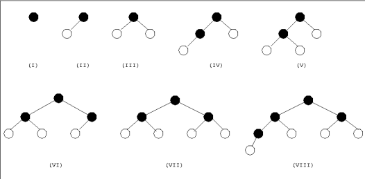
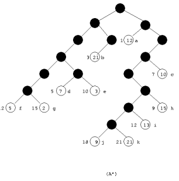

# Agentes de Solução de Problemas

## Objetivos

Agentes inteligentes buscam maximizar seu desempenho, o que é alcançado ao definir objetivos claros e específicos. Esses objetivos ajudam a simplificar a tomada de decisão, permitindo que o agente filtre as ações mais relevantes para alcançar o resultado desejado.

**Exemplo:** Em uma viagem de férias saindo de Goiânia, o agente pode definir como objetivo chegar a Brasília. Com esse objetivo em mente, ele pode focar apenas nas rotas que levam à capital federal, tornando a escolha da estrada mais eficiente.

## Formulação de Problemas

Para alcançar seus objetivos, o agente precisa formular o problema de maneira eficaz, selecionando as ações e estados mais adequados para a solução.

**Exemplo:** No contexto da viagem de Goiânia a Brasília:
- O objetivo é chegar a Brasília.
- As ações consideradas podem ser dirigir entre cidades como Goiânia para Formosa ou Alexânia para o Distrito Federal.

A formulação do problema envolve decidir quais ações e estados são relevantes para alcançar o objetivo de forma eficiente, ignorando detalhes irrelevantes.

## Busca e Execução

A resolução de problemas por um agente envolve:
1. Um **processo de busca** para encontrar uma sequência de ações que o conduza ao objetivo.
2. A **execução** dessa sequência sem ajustes baseados em percepções durante o percurso.

**Exemplo:** Durante a viagem de Goiânia a Brasília, o agente precisa buscar a melhor rota e, após identificá-la, segui-la rigidamente. Esse comportamento caracteriza um sistema de malha aberta, onde o agente não reage a mudanças no ambiente.

## Definindo Problemas

A formulação de um problema pode ser descrita por cinco componentes principais:

1. **Estado inicial:** Local onde o agente começa.
   - *Exemplo:* Goiânia.
2. **Ações disponíveis:** Opções que o agente pode tomar.
   - *Exemplo:* Dirigir de Goiânia para Formosa ou Alexânia.
3. **Modelo de transição:** Define como cada ação leva a um novo estado.
4. **Teste de objetivo:** Condição para verificar se o objetivo foi alcançado.
   - *Exemplo:* Chegar a Brasília.
5. **Função de custo:** Mede o custo de cada caminho.
   - *Exemplo:* Tempo ou distância das rotas.

Com essas informações, o agente pode encontrar a solução ótima.

---

# Problemas de Malha Aberta e Malha Fechada

## Malha Aberta

Em um sistema de **malha aberta**, o agente decide qual caminho seguir sem levar em conta o que aconteceu antes, ou seja, sem aprender com os erros ou acertos passados. Ele segue um conjunto de regras ou um plano pronto, sem se ajustar ao que encontra ao longo do caminho. Isso pode funcionar bem em problemas simples, onde é fácil prever a solução e o espaço de busca não é tão grande.

Porém, o problema é que, sem esse ajuste, o agente não consegue corrigir suas ações conforme vai avançando. Isso pode fazer com que ele tome decisões erradas, seguindo caminhos que não levam à solução ou desperdiçando tempo e recursos. A busca acaba sendo "cega", ou seja, o agente não aprende com a experiência e não consegue melhorar suas escolhas durante o processo.

## Malha Fechada

Por outro lado, em um sistema de **malha fechada**, o agente pode ajustar suas ações com base no feedback que recebe durante o processo de busca. A cada novo estado explorado, o agente reavaliará o caminho a seguir, ajustando sua estratégia para otimizar a busca.

Embora a **malha fechada** ofereça maior flexibilidade e capacidade de adaptação, ela exige mais poder de processamento. O agente precisa avaliar constantemente os estados e atualizar seu caminho, o que pode ser mais complexo computacionalmente.

---

# Algoritmos de Busca

Os algoritmos de busca são fundamentais para a resolução de problemas em inteligência artificial, permitindo que um agente encontre uma sequência de ações que o leve ao seu objetivo. Eles exploram um **espaço de estados**, o conjunto de todas as possíveis situações que o agente pode encontrar durante sua tarefa.

## Busca Cega

A **busca cega**, também conhecida como **busca não-informada**, é uma estratégia que não utiliza conhecimento prévio sobre o ambiente ou o objetivo final. Essas técnicas exploram o espaço de estados de forma sistemática, baseando-se apenas em uma função de enfileiramento para determinar os próximos passos.

### Busca em Largura

A **busca em largura** é um exemplo de busca cega, pois explora os estados sem utilizar informações sobre a solução, baseando-se apenas na ordem de geração dos estados. Ela explora todos os estados de um nível antes de avançar para o próximo. Essa abordagem é eficaz para encontrar a solução mais curta, mas pode consumir muita memória, já que armazena todos os estados do nível atual.

**Principais características:**
- Garante encontrar o caminho mais curto (caso os custos de transição sejam iguais).
- Alto consumo de memória em problemas de grande escala.

**Exemplo visual:**

  
*Figura 1: Demonstração teórica do funcionamento da busca em largura.*

## Busca Informada

A **busca informada** é uma estratégia que utiliza informação adicional para determinar a ordem de expansão dos nós durante o processo de busca. Essa informação, chamada de função de avaliação, ajuda a medir a probabilidade de um nó levar à solução, com base no seu estado atual. As buscas informadas tentam priorizar os nós que têm maior chance de levar à solução de forma mais eficiente.

  
*Figura 2: Demonstração teórica do funcionamento da busca informada.*

A **busca A\*** é um exemplo de busca informada, pois utiliza tanto o custo do caminho já percorrido \( g(n) \) quanto uma estimativa do custo restante para alcançar o objetivo \( h(n) \) para calcular a função de avaliação total \( f(n) = g(n) + h(n) \). Isso a torna mais eficiente, pois, em vez de explorar todos os caminhos igualmente, ela prioriza os nós que têm maior chance de levar à solução com base nessa avaliação.

---

# Funções Heurísticas

Uma **Função Heurística** é uma maneira de estimar quanto tempo ou esforço é necessário para resolver um problema a partir de um ponto específico. Ela pode ser criada com base em exemplos anteriores de como encontrar soluções, analisando características importantes do problema, como o número de peças fora do lugar em um quebra-cabeças. Essas características são combinadas para fazer uma previsão sobre o custo para alcançar a solução. Embora útil, a heurística não garante que sempre encontrará a solução mais rápida ou mais eficiente.

---

# Busca em Ambientes Complexos

Os algoritmos de busca local oferecem uma alternativa eficiente aos métodos sistemáticos, especialmente em problemas onde o caminho até o objetivo é irrelevante. Exemplos incluem o problema das oito rainhas e diversas aplicações de otimização, como roteamento de veículos e gerenciamento de carteiras. Em vez de explorar todos os caminhos possíveis, esses algoritmos concentram-se em um único estado atual, movendo-se apenas para os estados vizinhos que maximizem ou minimizem uma função objetivo.

## Vantagens da Busca Local

- **Baixo consumo de memória:** Apenas o estado atual é armazenado, reduzindo drasticamente o uso de recursos computacionais.
- **Adequação a grandes espaços de estados:** Funciona bem em problemas contínuos ou de larga escala, onde métodos sistemáticos são inviáveis.

A busca local é particularmente útil em problemas de otimização, onde o objetivo é identificar o melhor estado, conforme definido por uma função objetivo. A topologia do espaço de estados é crucial nesse processo, com cada estado representado por uma posição e uma "elevação" que reflete o custo ou o valor associado.

Algoritmos completos e ótimos são capazes de identificar objetivos ou alcançar valores extremos globais, seja um mínimo ou máximo, dependendo da formulação do problema. Por isso, a busca local é amplamente aplicada em áreas que demandam simplicidade e eficiência, como design de circuitos, escalonamento de tarefas e otimização de redes.

## Busca de Subida de Encosta

A busca de subida de encosta é um algoritmo local que ajusta o estado atual para o vizinho com o melhor valor da função objetivo, movendo-se continuamente "encosta acima". O algoritmo termina quando não há vizinhos com valores superiores, indicando que alcançou um ponto de estabilidade.

### Problemas Comuns

- **Máximos Locais:** O algoritmo pode parar em picos que não são a solução ideal, pois não consegue retroceder para explorar outras opções.
- **Cumes:** Regiões onde é necessário descer momentaneamente para alcançar soluções melhores, mas a busca não permite movimentos retrógrados.
- **Platôs:** Áreas planas onde todos os vizinhos têm o mesmo valor, tornando o progresso difícil e frequentemente levando à estagnação.

Apesar de suas limitações, a busca de subida de encosta é um método simples e eficiente em cenários onde o espaço de estados é bem definido e os problemas de interrupção são minimizados.

---

# Algoritmos Genéticos

Os algoritmos genéticos (AGs) são métodos de busca inspirados na teoria da evolução natural, propostos por Holland na década de 1970. Eles pertencem à classe dos algoritmos evolucionários, utilizando conceitos da genética e seleção natural para encontrar soluções próximas do ideal para problemas complexos e de difícil solução computacional (ZINI, 2009; ROMERO, 2005).

## Funcionamento Básico

Os AGs operam sobre uma população de indivíduos, onde cada indivíduo representa uma solução potencial para o problema em questão. Esses indivíduos são codificados geralmente como cadeias de bits ou sequências numéricas, análogas a cromossomos. O algoritmo segue os seguintes passos:

1. **Inicialização:** Uma população inicial é gerada, geralmente de forma aleatória.
2. **Avaliação:** Cada indivíduo é avaliado por uma função de adaptação (fitness), que mede a qualidade da solução.
3. **Seleção:** Indivíduos mais adaptados são selecionados para reprodução, com base na qualidade da função de adaptação.
4. **Reprodução:** Os indivíduos selecionados passam por operações genéticas, como:
   - **Cruzamento (crossover):** Combinação de genes de dois pais para criar descendentes.
   - **Mutação:** Pequenas alterações aleatórias nos genes para explorar novas áreas do espaço de soluções.
5. **Substituição:** A nova geração substitui a antiga, e o processo é repetido até atingir um critério de parada, como alcançar uma solução aceitável ou um número máximo de gerações (RUSSELL e NORVIG, 2022; ZINI, 2009).

## Vantagens

- **Exploração de grandes espaços de busca:** Graças ao uso de populações e operações genéticas, os AGs exploram amplamente o espaço de soluções.
- **Capacidade de escapar de ótimos locais:** Operações de mutação permitem explorar regiões não alcançadas por métodos locais.
- **Flexibilidade:** Podem ser aplicados a diversos tipos de problemas com funções objetivo complexas.

## Limitações

- **Convergência prematura:** Pode ocorrer caso a diversidade populacional se perca rapidamente, limitando a exploração.
- **Dependência de parâmetros:** O desempenho depende da escolha de parâmetros como tamanho da população, taxa de mutação e crossover.

## Problema das 8 damas

O problema das oito damas consiste em posiscionar oito damas em um tabuleiro de xadrez, de forma que nenhuma dama ataque a outra. É um problema clássico de otimização combinatória, ideal para aplicação de algoritmos genéticos.

   ### Etapas do algoritmo genético
   1. **Representação**: Cada solução (indivíduo) é representada como um vetor de 8 posições, indicando as linhas das damas em cada coluna.
   2. Avaliação: A função de adaptação calcula a qualidade de cada solução com base no número de pares de damas não atacantes, sendo 28 o número ideal.
   3. Seleção: Indivíduos mais aptos são escolhidos para reprodução, com base em sua qualidade (função de aptidão).
   4. Cruzamento: Dois indivíduos são combinados para criar novos descendentes, trocando partes de suas representações.
   5. Mutação: Algumas soluções passam por mutações aleatórias, alterando a posição de uma dama.
   6. Substituição: A população é atualizada com os novos indivíduos, e o processo se repete até encontrar uma solução ótima ou satisfatória.

Esse processo permite explorar o espaço de soluções de forma eficaz e encontrar soluções próximas ao ideal, resolvendo problemas complexos de otimização como o das oito damas.
   

