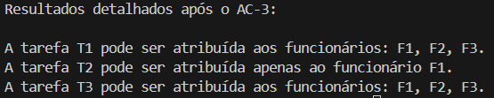

# Alocação de Recursos Utilizando o Algoritmo AC-3

Neste exemplo, abordamos um cenário simples de **alocação de recursos**, onde o objetivo é distribuir um conjunto de tarefas entre funcionários disponíveis, respeitando as **restrições de capacidade de trabalho** e a **compatibilidade entre tarefas e funcionários**.

## Contexto do Problema

Temos um conjunto de tarefas e um grupo de funcionários, com as seguintes características:

- **Tarefas**: Três tarefas precisam ser concluídas: **T1**, **T2** e **T3**, cada uma exigindo uma quantidade específica de horas para ser finalizada.
- **Funcionários**: Três funcionários estão disponíveis: **F1**, **F2** e **F3**, cada um com uma capacidade máxima de trabalho, medida em horas.

### Restrições

1. Cada tarefa deve ser atribuída a exatamente **um funcionário**.
2. A alocação deve respeitar a **capacidade máxima de trabalho** de cada funcionário:
   - Um funcionário não pode ser alocado a uma tarefa que exija mais horas do que ele é capaz de trabalhar.
3. As tarefas não podem ser divididas entre vários funcionários. Cada tarefa deve ser concluída por **um único funcionário**.

### Dados do Problema

#### Tarefas:
- **T1**: 6 horas
- **T2**: 8 horas
- **T3**: 4 horas

#### Funcionários:
- **F1**: capacidade de 8 horas
- **F2**: capacidade de 6 horas
- **F3**: capacidade de 7 horas

## Objetivo

Utilizar o **algoritmo AC-3** para garantir que os **domínios de alocação** das tarefas aos funcionários sejam consistentes com as restrições do problema. O AC-3 elimina combinações inviáveis, reduzindo os domínios das variáveis (tarefas/funcionários), de forma que a alocação final seja válida e otimizando o processo de decisão.

---

## Código

```python
from collections import deque

# Definição das variáveis
tarefas = ['T1', 'T2', 'T3']
funcionarios = ['F1', 'F2', 'F3']
capacidades = {'F1': 8, 'F2': 6, 'F3': 7}
horas_necessarias = {'T1': 6, 'T2': 8, 'T3': 4}

# Definição dos domínios iniciais (todos os funcionários podem inicialmente pegar qualquer tarefa)
dominios = {
    'T1': ['F1', 'F2', 'F3'],
    'T2': ['F1', 'F2', 'F3'],
    'T3': ['F1', 'F2', 'F3']
}

# Função para verificar se o domínio de uma tarefa é consistente
def ac3(dominios, tarefas, funcionarios, capacidades, horas_necessarias):
    # Criação da fila de arcos (restrições entre as tarefas e os funcionários)
    fila = deque()
    for tarefa in tarefas:
        for funcionario in funcionarios:
            fila.append((tarefa, funcionario))

    # Processamento dos arcos
    while fila:
        tarefa, funcionario = fila.popleft()

        # Verifica se a tarefa pode ser alocada ao funcionário
        if funcionario in dominios[tarefa]:
            if horas_necessarias[tarefa] > capacidades[funcionario]:
                dominios[tarefa].remove(funcionario)
                
                # Se o domínio de uma tarefa foi alterado, reprocessar os arcos relacionados a essa tarefa
                for tarefa_relacionada in tarefas:
                    if funcionario in dominios[tarefa_relacionada]:
                        fila.append((tarefa_relacionada, funcionario))

    return dominios

# Executando o AC-3
dominios_resultado = ac3(dominios, tarefas, funcionarios, capacidades, horas_necessarias)

# Exibindo os resultados detalhados
print("\nResultados detalhados após o AC-3:\n")
for tarefa, dominio in dominios_resultado.items():
    if len(dominio) == 1:
        print(f"A tarefa {tarefa} pode ser atribuída apenas ao funcionário {dominio[0]}.")
    elif len(dominio) > 1:
        funcionarios_disp = ", ".join(dominio)
        print(f"A tarefa {tarefa} pode ser atribuída aos funcionários: {funcionarios_disp}.")
    else:
        print(f"A tarefa {tarefa} não pode ser atribuída a nenhum funcionário.")
```
## Explicação do Código

### Definição das Variáveis

- **Tarefas e Funcionários**: Representados como listas, facilitando a manipulação e a iteração.
- **Capacidades e Horas Necessárias**: Armazenadas em dicionários para permitir acesso rápido às informações.
- **Domínios**: Inicialmente, cada tarefa pode ser alocada a qualquer funcionário, sem restrições.

### Função `ac3`

1. A função **cria uma fila de arcos**, representando as relações entre as tarefas e os funcionários.
2. Para cada arco, verifica-se se o funcionário é capaz de realizar a tarefa, considerando sua capacidade máxima:
   - Caso o funcionário não tenha capacidade suficiente, ele é removido do domínio da tarefa.
3. Sempre que o domínio de uma tarefa é alterado, os arcos relacionados são **reprocessados**, garantindo que as restrições sejam propagadas corretamente.

## Resultado

O algoritmo retorna os domínios finais de alocação de tarefas após aplicar o AC-3, garantindo que as alocações respeitem as restrições de capacidade.

### Resultado Esperado

Após executar o código, o domínio final das alocações pode ser mostrado com a seguinte saída esperada:

  
*Figura 1: Resultado do problema de alocação de produto, com o algoritmo AC-3.*


### Interpretação do Resultado

- **T1 (6 horas)**: A tarefa T1 pode ser alocada ao **F1**, **F2**, ou **F3**, pois todos têm capacidade suficiente para completá-la.
- **T2 (8 horas)**: A tarefa T2 pode ser alocada apenas ao **F1**, já que o **F2** e o **F3** não têm capacidade suficiente para realizar essa tarefa.
- **T3 (4 horas)**: A tarefa T3 pode ser alocada ao **F1**, **F2**, ou **F3**, pois todos têm capacidade suficiente para completá-la.

## Conclusão

Neste exemplo prático de alocação de recursos, o algoritmo AC-3 foi utilizado para verificar e reduzir os domínios de alocação das tarefas aos funcionários. O processo garantiu que as alocações respeitassem as restrições de capacidade de trabalho, eliminando combinações inviáveis. 

O resultado final simplifica o processo de decisão para alocar tarefas aos funcionários e garante consistência. Este exemplo pode ser facilmente expandido para cenários mais complexos, incluindo um número maior de tarefas, funcionários ou restrições específicas.

