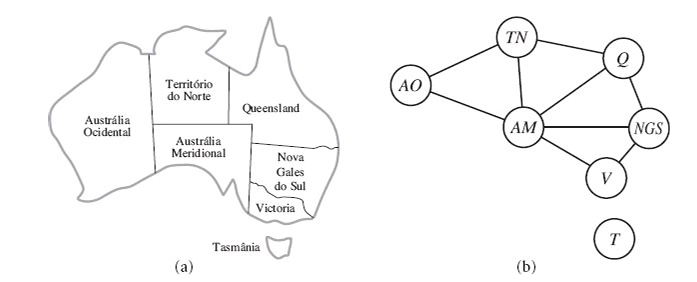

# Representação Atômica vs Fatorada

A **representação atômica** e a **representação fatorada** são duas abordagens distintas para representar estados em ambientes de sistemas de inteligência artificial (IA). Enquanto a representação atômica trata os estados como entidades indivisíveis e simples, a representação fatorada decompõe esses estados em variáveis e atributos, permitindo maior flexibilidade e expressividade. Ambas as abordagens possuem vantagens e limitações, dependendo do tipo de problema a ser resolvido e dos requisitos de detalhamento e eficiência computacional.

## 1. Representação Atômica

Na **representação atômica**, os estados do ambiente são tratados como **indivisíveis** ou **caixas-pretas**, sem qualquer estrutura interna que possa ser manipulada diretamente. Russell e Norvig (2022) destacam que, "do ponto de vista do algoritmo de busca, cada estado é atômico, ou indivisível — uma caixa-preta, sem estrutura interna". Isso implica que as transições entre os estados são definidas de forma direta, sem levar em consideração características ou atributos internos. 

Como exemplo, podemos imaginar um agente que deve se deslocar de um ponto A para um ponto B. Na abordagem atômica, o agente sabe apenas que deve ir de A para B, sem considerar elementos adicionais, como o tipo de terreno ou o tempo necessário. Essa simplicidade reduz a complexidade computacional, mas limita a capacidade do agente de realizar planejamentos mais elaborados. Schier (2024) reforça que "o estado do ambiente de tarefas, obtido por meio dos sensores, também não pode ser decomposto em qualquer tipo de estrutura interna".

## 2. Representação Fatorada

A **representação fatorada**, por outro lado, permite descrever os estados do ambiente como conjuntos de **variáveis**, cada uma com um valor associado. Segundo Russell e Norvig (2022), "utilizaremos uma representação fatorada para cada estado: um conjunto de variáveis, cada qual com um valor". Isso possibilita uma descrição mais detalhada e rica do ambiente, onde os estados podem ser caracterizados por atributos específicos que variam conforme a situação.

Por exemplo, ao se deslocar de A para B, um agente que utiliza uma representação fatorada pode considerar variáveis como a qualidade do terreno, a distância, o consumo de energia e o tempo estimado. Essa abordagem é particularmente útil em problemas de satisfação de restrição (PSR), nos quais o objetivo é atribuir valores às variáveis de forma a satisfazer todas as restrições impostas.

Schier (2024) complementa que "os estados do ambiente podem ser caracterizados por meio da atribuição de um determinado número de atributos aos objetos". Isso oferece ao agente uma base mais detalhada para tomar decisões e planejar ações, mas com um custo computacional mais elevado em comparação à abordagem atômica.

---

# Definindo Problemas de satisfação de condições

Um **Problema de Satisfação de Restrições (PSR)** é uma forma de modelar problemas em termos de variáveis, valores e restrições. Ele é definido por três componentes principais:

- **Variáveis (X)**: Representam os elementos do problema, como X₁, X₂, ..., Xₙ.  
- **Domínios (D)**: Conjuntos de valores possíveis para cada variável, como D₁, D₂, ..., Dₙ.  
- **Restrições (C)**: Regras que especificam combinações válidas de valores entre as variáveis.  

Uma **solução** para um PSR é uma atribuição de valores que seja consistente (não viole nenhuma restrição) e completa (todas as variáveis têm um valor). 

  
*Figura 1: Demonstração com imagem do problema de coloração de mapas.*

Por exemplo, no problema de coloração de mapas, demonstrado na figura acima, o objetivo é colorir cada região com uma cor (vermelho, verde ou azul) de forma que regiões vizinhas tenham cores diferentes. Esse tipo de modelagem é eficiente porque permite descartar atribuições inválidas rapidamente e focar em soluções viáveis.

Os PSRs são amplamente aplicados devido à sua flexibilidade e eficiência na resolução de problemas complexos, especialmente quando comparados com métodos tradicionais de busca em espaço de estados.

---

# Tipos de condições

- **Restrições Unitárias**: Limitam o valor de uma única variável. Por exemplo, uma região do mapa não pode ser verde (e.g., SA ≠ G).

- **Restrições Binárias**: Estabelecem relações entre duas variáveis. Por exemplo, duas regiões adjacentes não podem ter a mesma cor (e.g., SA ≠ NSW).

- **Restrições Ternárias**: Relacionam três variáveis, como em uma condição de ordem (e.g., X > Y > Z).

- **Restrições Globais**: Envolvem um número arbitrário de variáveis, mas não necessariamente todas. Um exemplo comum é a restrição "TodosDiferentes" (e.g., Alldiff(A1, A2, A3, B1, B2, B3, C1, C2, C3)).

Qualquer PSR pode ser transformado em um PSR que contenha apenas restrições binárias. Por exemplo, uma restrição ternária como X > Y > Z pode ser reescrita como X > Y e Y > Z.

## Condições de Preferência

Além das restrições necessárias, podem-se incluir condições de preferência para modelar soluções ideais. Por exemplo:

- Nenhum professor pode dar duas aulas ao mesmo tempo (condição necessária).  
- O professor A prefere dar aulas pela manhã (condição preferencial).  
- Uma sala X deve, preferencialmente, receber turmas maiores.

As condições de preferência são úteis para encontrar soluções que, embora válidas, sejam também otimizadas para os critérios desejados.

---
# Consistência

A consistência local é uma técnica central em algoritmos para PSRs que busca simplificar o problema antes ou durante a busca de soluções. Essa abordagem utiliza as restrições do problema para reduzir os valores possíveis de variáveis, eliminando valores inconsistentes e propagando essas reduções para outras variáveis. Visualizando o problema como um grafo, onde as variáveis são nós e as restrições binárias são arcos, a consistência local pode ser aplicada em diferentes níveis, como consistência de nó, arco, caminho e consistência k. Além disso, restrições globais podem ser usadas para simplificar problemas complexos de maneira eficiente.

## 1. Nó

A *consistência de nó* é um conceito aplicado a redes de restrições (PSR - *Constraint Satisfaction Problems*), onde uma variável é considerada *nó-consistente* se todos os valores no seu domínio satisfizerem as restrições unárias dessa variável. Em outras palavras, cada valor permitido para uma variável deve cumprir com as condições impostas a essa variável.

Por exemplo, no problema de coloração do mapa da Austrália, demonstrado na *figura 1*, onde a região "SA" não pode ser colorida de verde, se o domínio inicial de "SA" for {vermelho, verde, azul}, podemos tornar essa variável nó-consistente ao eliminar a cor verde. O domínio reduzido de "SA" seria então {vermelho, azul}.

A rede é considerada *nó-consistente* se todas as suas variáveis forem nó-consistentes. Em um PSR, é possível eliminar as restrições unárias de todas as variáveis ao executar a consistência de nó.

Essa abordagem também é útil para transformar restrições n-árias em binárias, o que facilita a resolução de PSRs, pois muitos solucionadores de PSR trabalham com restrições binárias (Russell & Norvig, 2022).

## 2. Arco

Uma variável em um *Problema de Satisfação de Restrições* (CSP) é considerada *arco-consistente* se todos os valores no seu domínio satisfizerem as restrições binárias relacionadas a essa variável. De forma mais formal, uma variável \(X_i\) é arco-consistente em relação a outra variável \(X_j\) se, para cada valor no domínio de \(X_i\), existir algum valor no domínio de \(X_j\) que satisfaça a restrição binária entre \(X_i\) e \(X_j\). 

Uma rede é considerada *arco-consistente* se todas as suas variáveis forem arco-consistentes entre si.

Por exemplo, suponha que a restrição entre duas variáveis \(X\) e \(Y\) seja \(Y = X^2\), onde o domínio de ambas as variáveis é o conjunto de dígitos. Podemos escrever essa restrição explicitamente como:

\[
Y = X^2
\]

Para tornar \(X\) arco-consistente em relação a \(Y\), o domínio de \(X\) seria reduzido a \{0, 1, 2, 3\}. De maneira semelhante, para tornar \(Y\) arco-consistente em relação a \(X\), o domínio de \(Y\) seria reduzido a \{0, 1, 4, 9\}, e a rede inteira se tornaria arco-consistente.

No entanto, a consistência de arco não sempre tem impacto. Por exemplo, no problema de coloração do mapa da Austrália, a restrição de desigualdade entre duas regiões, como AM e AO, não restringe o valor de nenhuma das variáveis, pois para qualquer valor atribuído a AM ou AO, sempre haverá uma opção válida para a outra variável. Assim, a aplicação da consistência de arco não teria efeito sobre os domínios das variáveis.

## 3. Trajeto

A *consistência de trajeto* é uma forma mais forte de consistência em redes de restrições, onde um conjunto de duas variáveis \(\{X_i, X_j\}\) é considerado consistente em relação a uma terceira variável \(X_m\) se, para cada atribuição consistente entre \(X_i\) e \(X_j\), existir uma atribuição para \(X_m\) que satisfaça as restrições binárias entre todas as variáveis. Esse conceito é útil para verificar relações implícitas entre as variáveis.

No exemplo da coloração do mapa da Austrália com duas cores, a consistência de trajeto mostra que, para algumas atribuições, não é possível atribuir uma cor válida a uma variável intermediária, como no caso de \(TN\) não podendo ser nem vermelho nem azul, resultando em uma conclusão de que não há solução viável.

O algoritmo *PC-2* (Mackworth, 1977) é usado para alcançar a consistência de trajeto, de forma semelhante ao *AC-3* para consistência de arco.

## 4. K

A *k-consistência* é uma forma mais geral de propagação de consistência em redes de restrições (PSR). Uma PSR é considerada k-consistente se, para qualquer conjunto de \(k - 1\) variáveis e qualquer atribuição consistente a essas variáveis, sempre é possível atribuir um valor consistente à variável \(k\)-ésima. 

- A *1-consistência* corresponde à consistência de nó, onde qualquer variável pode ser atribuída com um valor que satisfaça as restrições unárias.
- A *2-consistência* é equivalente à consistência de arco, onde cada variável deve ser consistente com todas as outras variáveis nas restrições binárias.
- A *3-consistência* corresponde à consistência de caminho, que verifica a consistência entre três variáveis ao mesmo tempo.

Uma PSR é chamada de *fortemente k-consistente* se for k-consistente e também \((k - 1)\)-consistente, \((k - 2)\)-consistente, e assim por diante até 1-consistente.

Se uma PSR for fortemente n-consistente (ou seja, k-consistente para \(k = n\), com \(n\) sendo o número total de variáveis), o problema pode ser resolvido de forma eficiente. Ao escolher um valor consistente para \(X_1\), a 2-consistência garante a escolha para \(X_2\), a 3-consistência para \(X_3\), e assim por diante. Esse processo permite encontrar uma solução no tempo \(O(n^2d)\), onde \(d\) é o número de valores no domínio.

Entretanto, há uma desvantagem: o tempo necessário para estabelecer a consistência é exponencial no pior caso, e a memória necessária também cresce exponencialmente com \(n\). Na prática, a verificação de consistência de 2-nível é comum, enquanto a verificação de 3-consistência é menos frequente, devido ao alto custo computacional.

## 5. Globais

As *restrições globais* envolvem várias variáveis e podem ser tratadas com algoritmos especializados, mais eficientes que os métodos gerais. Um exemplo é a restrição *TodosDiferentes*, que exige valores distintos para todas as variáveis. Uma maneira simples de detectar inconsistência é, se o número de variáveis \(m\) for maior que o número de valores \(n\), a restrição não pode ser satisfeita.

Outro exemplo é a restrição *atmost*, que limita a soma de variáveis, como "não mais que 10 pessoas" em quatro tarefas. A inconsistência pode ser detectada verificando a soma dos valores mínimos nos domínios das variáveis.

Algoritmos para restrições globais podem ser mais eficientes que a consistência de arco, mas, em alguns casos, exigem maior custo computacional.

---

# Algoritmos

## 1. AC-3 (Algoritmo de Consistência de Arco)
O AC-3 é um algoritmo usado para garantir a consistência de arco em redes de restrições. Ele trabalha verificando todas as restrições binárias entre as variáveis, removendo valores incompatíveis nos domínios das variáveis. O algoritmo continua a processar até que não haja mais mudanças nos domínios. Isso ajuda a reduzir os domínios das variáveis e pode simplificar a solução do problema.

## 2. Sudoku - Exemplo de CSP

O Sudoku é um exemplo clássico de problema de satisfação de restrições (CSP). As variáveis são as células do tabuleiro, os domínios são os números de 1 a 9, e as restrições são as regras de que cada número deve aparecer uma vez por linha, coluna e bloco 3x3. Resolver o Sudoku envolve atribuir números às células de maneira que todas as restrições sejam satisfeitas.

## 3. Pesquisa backtraking para CSPs

A pesquisa backtracking é uma técnica de busca que tenta atribuir valores às variáveis de um CSP. Se uma atribuição viola uma restrição, o algoritmo retrocede e tenta outra possibilidade. Esse processo continua até encontrar uma solução ou determinar que o problema é impossível. É uma abordagem completa, mas pode ser ineficiente sem técnicas de poda, como a consistência de arco.

## 4. Intercalando pesquisa e inferência para CSPs

Essa abordagem combina pesquisa backtracking com técnicas de inferência (como AC-3 ou consistência de caminho). A inferência é usada para reduzir os domínios das variáveis antes ou durante a busca, simplificando o problema. Isso pode levar a uma solução mais rápida, pois reduz o número de decisões de atribuição durante a busca.

## 5. Busca local para CSPs

A busca local envolve a exploração de soluções próximas a uma solução parcial já existente. Em CSPs, isso pode ser feito através de algoritmos como *hill climbing* ou *simulated annealing*, que tentam melhorar uma solução existente movendo-se em direção a uma solução melhor, sem a necessidade de examinar todo o espaço de soluções. Embora seja mais eficiente que a busca exaustiva, pode não encontrar a solução global.

# Estrutura de problemas

