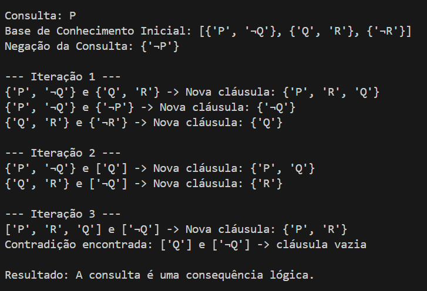
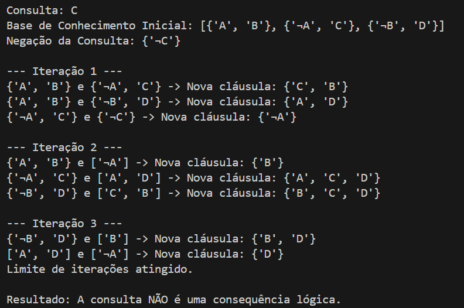

# Aplicação do Algoritmo de Resolução

O **algoritmo de resolução** é amplamente utilizado em inteligência artificial para provar sentenças lógicas a partir de uma base de conhecimento. Ele opera por refutação, verificando se a negação de uma consulta leva a uma contradição. A seguir, exploramos seu uso com exemplos práticos e uma implementação em Python.

## Problema Prático

Considere duas bases de conhecimento distintas e consultas associadas:

### Caso 1: Consequência Lógica
- **Base de Conhecimento:**
  1. (P ∨ ¬Q)
  2. (Q ∨ R)
  3. (¬R)
- **Consulta:** P

### Caso 2: Não Consequência Lógica
- **Base de Conhecimento:**
  1. (A ∨ B)
  2. (¬A ∨ C)
  3. (¬B ∨ D)
- **Consulta:** C

Nosso objetivo é determinar se as consultas são consequências lógicas das respectivas bases de conhecimento.

## Implementação do Algoritmo

A seguir, apresentamos um algoritmo que resolve o problema utilizando o método de prova por refutação.

```python
def resolve(clause1, clause2):
    """
    Realiza a resolução entre duas cláusulas.
    Retorna a nova cláusula gerada ou None se não houver resolução possível.
    """
    new_clause = set()
    resolved = False

    for literal in clause1:
        if f"¬{literal}" in clause2:
            resolved = True
            new_clause.update(clause1 - {literal})
            new_clause.update(clause2 - {f"¬{literal}"})
        elif literal.startswith("¬") and literal[1:] in clause2:
            resolved = True
            new_clause.update(clause1 - {literal})
            new_clause.update(clause2 - {literal[1:]})

    return new_clause if resolved else None


def resolution(kb, query):
    """
    Aplica o algoritmo de resolução para verificar se a query é uma consequência lógica da base de conhecimento.
    """
    # Negação da consulta adicionada à base de conhecimento
    negated_query = {f"¬{query}"} if not query.startswith("¬") else {query[1:]}
    clauses = kb + [negated_query]

    new_clauses = set()
    while True:
        # Combinação de pares de cláusulas
        pairs = [(clauses[i], clauses[j]) for i in range(len(clauses)) for j in range(i + 1, len(clauses))]
        for c1, c2 in pairs:
            resolvent = resolve(set(c1), set(c2))
            if resolvent is not None:
                if not resolvent:  # Contradição encontrada (cláusula vazia)
                    return True
                new_clauses.add(frozenset(resolvent))

        # Verifica se novas cláusulas foram geradas
        if new_clauses.issubset(map(frozenset, clauses)):
            return False

        clauses.extend(map(list, new_clauses))

# Base de conhecimento
knowledge_base = [
    {"A", "B"},
    {"¬A", "C"},
    {"¬B", "¬C"}
]

# Consulta
query = "¬C"

# Verificação
result = resolution(knowledge_base, query)
if result:
    print("A consulta é uma consequência lógica da base de conhecimento.")
else:
    print("A consulta NÃO é uma consequência lógica da base de conhecimento.")


```
## Explicação do Código

### Função `resolve`

A função `resolve` realiza a resolução entre duas cláusulas. Ela identifica literais complementares (como `A` e `¬A`) e, ao encontrá-los, combina os literais restantes das cláusulas, formando uma nova cláusula.

### Função `resolution`

A função `resolution` segue os passos abaixo:
1. Adiciona a negação da consulta à base de conhecimento.
2. Combina pares de cláusulas existentes e aplica a função `resolve` para gerar novas cláusulas.
3. Verifica se a cláusula vazia foi gerada (indicando contradição).
4. Retorna `True` se a consulta é uma consequência lógica ou `False` caso contrário.

## Execução e Resultados

### Caso 1: Consequência Lógica

- **Consulta:** P  
- **Base de Conhecimento Inicial:** [{'P', '¬Q'}, {'Q', 'R'}, {'¬R'}]  
- **Negação da Consulta:** {'¬P'}

#### Iterações:

  
*Figura 1: Exemplo teórico do funcionamento do algoritmo para o Caso 1.*

**Resultado:** A consulta é uma consequência lógica da base.

---

### Caso 2: Não Consequência Lógica

- **Consulta:** C  
- **Base de Conhecimento Inicial:** [{'A', 'B'}, {'¬A', 'C'}, {'¬B', 'D'}]  
- **Negação da Consulta:** {'¬C'}

#### Iterações:

  
*Figura 2: Exemplo teórico do funcionamento do algoritmo para o Caso 2.*

**Resultado:** A consulta NÃO é uma consequência lógica da base.

---

## Conclusão

O algoritmo de resolução demonstra ser uma ferramenta eficaz para inferência lógica, permitindo determinar se uma sentença é consequência lógica de uma base de conhecimento. Apesar de sua eficiência ser influenciada pela complexidade computacional e pelo número de cláusulas geradas, ele continua sendo amplamente utilizado em sistemas baseados em conhecimento, como provas automatizadas e diagnósticos lógicos.


