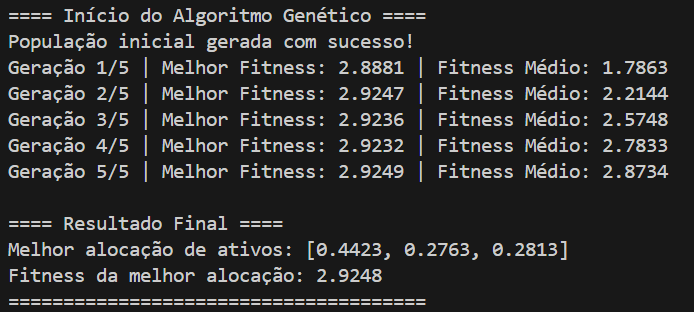

# Algoritmo Genético para Alocação de Ativos

Este projeto utiliza um **algoritmo genético** para otimizar a alocação de ativos em um portfólio financeiro, visando maximizar a razão entre o retorno e o risco (volatilidade). O algoritmo considera a alocação de 3 ativos financeiros e usa dados históricos para calcular o retorno esperado e a volatilidade do portfólio.

## Estrutura do Projeto

O projeto é composto por três arquivos principais:

1. **`main.py`**: Implementação do algoritmo genético e execução do processo.
2. **`algoritmoGenetico.py`**: Contém as funções para gerar a população inicial, selecionar os melhores indivíduos, aplicar cruzamento e mutação.
3. **`portifolio.py`**: Contém as funções para calcular o **fitness** (razão retorno/risco) de cada alocação e obter os dados financeiros.
4. **`data.py`**: Fornece os dados financeiros (retornos históricos e matriz de covariância).

## Funcionalidade do Algoritmo Genético

O algoritmo genético simula um processo de evolução, onde a **população** de soluções (alocações de ativos) é evoluída ao longo de várias gerações para encontrar a melhor solução. As principais etapas são:

- **Geração da população inicial**: Criação de alocações aleatórias de ativos que somam 1.
- **Seleção**: Seleção dos melhores indivíduos com base no seu desempenho (fitness).
- **Cruzamento**: Combinação de dois pais para gerar um novo indivíduo (filho).
- **Mutação**: Alteração aleatória em um indivíduo para introduzir diversidade.

## Descrição do Código

### `main.py`
```python
from algoritmoGenetico import gerar_populacao, selecao, cruzamento, mutacao
from portifolio import calcular_fitness
import numpy as np
import random

# Parâmetros
tamanho_populacao = 100
num_geracoes = 5
taxa_mutacao = 0.05
num_ativos = 3  # Número de ativos no portfólio

# Executa o algoritmo genético
def algoritmo_genetico(tamanho_populacao, num_geracoes, taxa_mutacao):
    # Inicializa a população
    populacao = gerar_populacao(tamanho_populacao, num_ativos)
    
    for geracao in range(num_geracoes):
        # Avalia o fitness de cada indivíduo
        fitnesses = [calcular_fitness(individuo) for individuo in populacao]
        
        # Informações sobre a geração atual
        melhor_fitness = max(fitnesses)
        media_fitness = np.mean(fitnesses)
        print(f"Geração {geracao + 1}/{num_geracoes} | Melhor Fitness: {melhor_fitness:.4f} | Fitness Médio: {media_fitness:.4f}")
        
        # Seleciona os melhores indivíduos
        melhores = selecao(populacao, fitnesses, tamanho_populacao // 2)
        
        # Gera novos indivíduos através de cruzamento
        nova_populacao = []
        while len(nova_populacao) < tamanho_populacao:
            pai1, pai2 = random.sample(melhores, 2)
            filho = cruzamento(pai1, pai2)
            nova_populacao.append(filho)
        
        # Aplica mutação
        nova_populacao = [mutacao(individuo, taxa_mutacao) for individuo in nova_populacao]
        
        # Atualiza a população
        populacao = nova_populacao
    
    # Retorna a melhor solução encontrada
    fitnesses = [calcular_fitness(individuo) for individuo in populacao]
    melhor_individuo = populacao[np.argmax(fitnesses)]
    melhor_fitness = max(fitnesses)
    return melhor_individuo, melhor_fitness

# Execução
try:
    print("==== Início do Algoritmo Genético ====")
    melhor_alocacao, melhor_fitness = algoritmo_genetico(tamanho_populacao, num_geracoes, taxa_mutacao)
    print("\n==== Resultado Final ====")
    print("Melhor alocação de ativos:", [round(valor, 4) for valor in melhor_alocacao])
    print(f"Fitness da melhor alocação: {melhor_fitness:.4f}")
    print("======================================")
except ValueError as e:
    print(f"Erro durante a execução do algoritmo: {e}")
```

### `portifolio.py`
```python
import numpy as np
from data import get_retorno_medio, get_matriz_covariancia

# Função para calcular o fitness (retorno / risco)
def calcular_fitness(alocacao: list) -> float:
    if alocacao is None or not isinstance(alocacao, list):
        print(f"Erro: A alocação recebida é inválida: {alocacao}")
        raise ValueError("A alocação deve ser uma lista válida e não pode ser None.")
    
    retorno_medio_diario = get_retorno_medio()
    matriz_covariancia = get_matriz_covariancia()
    
    # Garantir que a soma da alocação seja igual a 1
    soma_alocacao = sum(alocacao)
    if soma_alocacao == 0:
        print(f"Erro: Soma da alocação é zero: {alocacao}")
        raise ValueError("A soma da alocação é zero, o que não é permitido.")
    
    alocacao_normalizada = np.array(alocacao) / soma_alocacao

    # Calculando o retorno esperado do portfólio
    retorno_esperado = np.dot(retorno_medio_diario, alocacao_normalizada)

    # Calculando o risco (volatilidade) do portfólio
    risco = np.sqrt(np.dot(alocacao_normalizada.T, np.dot(matriz_covariancia, alocacao_normalizada)))

    # Fitness é a razão retorno/risco
    if risco == 0:  # Prevenção de divisão por zero
        return -np.inf
    return retorno_esperado / risco
```
### `algoritmoGenetico.py`
```python
import random
import numpy as np
from portifolio import calcular_fitness

# Função para gerar a população inicial
def gerar_populacao(tamanho_populacao: int, num_ativos: int) -> list:
    """
    Gera uma população inicial de indivíduos aleatórios.
    Cada indivíduo é uma lista de alocações normalizadas que somam 1.
    """
    populacao = []
    for idx in range(tamanho_populacao):
        individuo = [random.uniform(0, 1) for _ in range(num_ativos)]
        soma = sum(individuo)
        if soma == 0:  # Previne divisão por zero
            individuo = [1 / num_ativos] * num_ativos
        else:
            individuo = [i / soma for i in individuo]  # Normaliza para que a soma seja 1

        # Garantir que o indivíduo seja válido
        if not isinstance(individuo, list) or len(individuo) != num_ativos:
            print(f"Indivíduo inválido gerado na iteração {idx}: {individuo}")
            raise ValueError("Erro na geração da população inicial.")
        
        populacao.append(individuo)
    
    print("População inicial gerada com sucesso!")
    return populacao

# Função de seleção (seleciona os melhores indivíduos)
def selecao(populacao: list, fitnesses: list, num_selecionados: int) -> list:
    """
    Seleciona os melhores indivíduos com base nos valores de fitness.
    """
    selecionados_indices = np.argsort(fitnesses)[-num_selecionados:]  # Índices dos melhores
    selecionados = [populacao[i] for i in selecionados_indices]
    return selecionados

# Função de cruzamento (reprodução)
def cruzamento(pai1: list, pai2: list) -> list:
    """
    Realiza o cruzamento entre dois pais para gerar um novo indivíduo.
    """
    if not pai1 or not pai2:
        print(f"Erro: Pai inválido no cruzamento. Pai1: {pai1}, Pai2: {pai2}")
        raise ValueError("Pais inválidos para cruzamento.")
    
    ponto = random.randint(1, len(pai1) - 1)
    filho = pai1[:ponto] + pai2[ponto:]
    soma = sum(filho)
    if soma == 0:  # Evita divisão por zero
        filho = [1 / len(filho)] * len(filho)
    else:
        filho = [i / soma for i in filho]  # Normaliza após o cruzamento
    
    return filho

# Função de mutação
def mutacao(individuo: list, taxa_mutacao: float) -> list:
    """
    Aplica mutação a um indivíduo com uma determinada taxa de mutação.
    """
    if not individuo or not isinstance(individuo, list):
        print(f"Erro: Indivíduo inválido recebido para mutação: {individuo}")
        raise ValueError("Indivíduo inválido para mutação.")
    
    if random.random() < taxa_mutacao:
        indice = random.randint(0, len(individuo) - 1)
        individuo[indice] = random.uniform(0, 1)  # Modifica aleatoriamente
        soma = sum(individuo)
        if soma == 0:  # Evita divisão por zero
            individuo = [1 / len(individuo)] * len(individuo)
        else:
            individuo = [i / soma for i in individuo]  # Normaliza após mutação
    
    return individuo

# Função principal do algoritmo genético
def algoritmo_genetico(tamanho_populacao: int, num_geracoes: int, taxa_mutacao: float, num_ativos: int):
    """
    Executa o algoritmo genético para encontrar a melhor alocação de ativos.
    """
    # Inicializa a população
    populacao = gerar_populacao(tamanho_populacao, num_ativos)
    
    for geracao in range(num_geracoes):
        print(f"Gerando geração {geracao + 1}...")
        
        # Avalia o fitness de cada indivíduo
        fitnesses = [calcular_fitness(individuo) for individuo in populacao]
        
        # Seleciona os melhores indivíduos
        melhores = selecao(populacao, fitnesses, tamanho_populacao // 2)
        
        # Gera novos indivíduos através de cruzamento
        nova_populacao = []
        while len(nova_populacao) < tamanho_populacao:
            pai1, pai2 = random.sample(melhores, 2)
            filho = cruzamento(pai1, pai2)
            nova_populacao.append(filho)
        
        # Aplica mutação
        nova_populacao = [mutacao(individuo, taxa_mutacao) for individuo in nova_populacao]
        
        # Atualiza a população
        populacao = nova_populacao
    
    # Retorna o melhor indivíduo encontrado
    fitnesses = [calcular_fitness(individuo) for individuo in populacao]
    melhor_individuo = populacao[np.argmax(fitnesses)]
    melhor_fitness = max(fitnesses)
    
    print(f"Melhor indivíduo encontrado: {melhor_individuo}")
    print(f"Fitness do melhor indivíduo: {melhor_fitness}")
    return melhor_individuo
```

### `data.py`
```python
import pandas as pd

# Definindo os dados de ativos financeiros
dados_ativos = {
    'Ativo1': [0.01, 0.02, -0.01, 0.015, 0.005, -0.005, 0.008, 0.01],
    'Ativo2': [0.005, 0.01, 0.02, -0.005, 0.015, 0.02, -0.01, 0.008],
    'Ativo3': [0.02, -0.01, 0.015, 0.01, 0.005, 0.02, 0.01, -0.005]
}

# Converter para DataFrame
df = pd.DataFrame(dados_ativos)

# Calcular o retorno médio diário de cada ativo
retorno_medio_diario = df.mean()

# Calcular a matriz de covariância (para calcular o risco)
matriz_covariancia = df.cov()

def get_retorno_medio():
    return retorno_medio_diario

def get_matriz_covariancia():
    return matriz_covariancia
```
## Resultado

  
*Figura 1: Resultado.*

A execução do algoritmo genético resultou na alocação ótima de ativos. O processo foi realizado ao longo de 5 gerações, com as métricas de fitness sendo avaliadas em cada geração. O fitness é calculado como a razão entre o retorno esperado e o risco (volatilidade) do portfólio.

Durante o processo de evolução, observamos que o melhor fitness aumentou progressivamente, indicando uma melhoria na qualidade da solução ao longo das gerações. A cada geração, o algoritmo selecionava as melhores alocações, cruzava e aplicava mutação, o que resultou em uma melhoria contínua.

Ao final de 5 gerações, a melhor alocação de ativos foi:
[0.4423, 0.2763, 0.2813]

O fitness da melhor alocação foi de 2.9248, o que representa a razão otimizada entre retorno e risco para o portfólio. Isso significa que, com esta alocação, o portfólio atinge um bom equilíbrio entre risco e retorno esperado.

O gráfico (Figura 1) ilustra a evolução do fitness ao longo das gerações, mostrando o crescimento da solução à medida que o algoritmo avançava.

